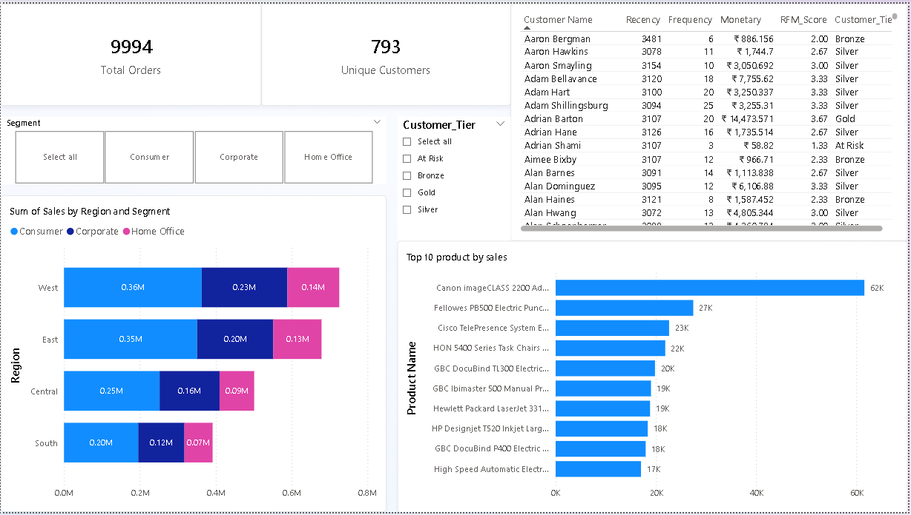
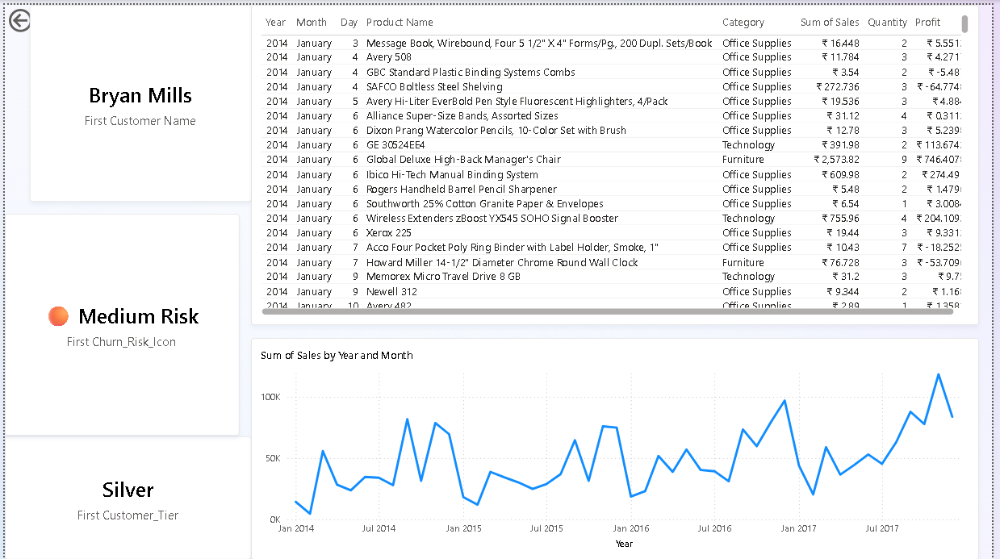

# Customer 360 Report - Power BI

## Overview
Customer analytics dashboard with RFM scoring, tier segmentation, and drill-through capabilities.

## Key Features
- **RFM Scoring**: Recency, Frequency, Monetary analysis
- **Customer Tiers**: Platinum, Gold, Silver, Bronze, At Risk
- **Churn Risk**: Visual indicators (🟢🟡🟠🔴⚠️)
- **Lifetime Value**: Total sales per customer
- **Product Affinity**: Top 10 products by sales
- **Drill-Through**: Click any customer to see full purchase history

## Data Source
Superstore dataset (10,000+ orders, 793 customers)

## Skills Demonstrated
- DAX (CALCULATE, DATEDIFF, SWITCH, FILTER)
- Drill-through pages
- RFM analysis
- Customer segmentation
- Visual formatting

## Screenshots

